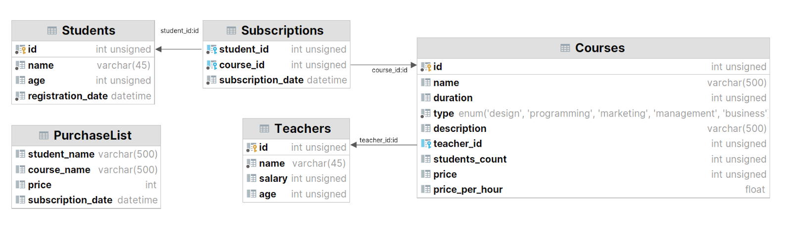

- Создайте новый проект в папке SQLAndHibernate из репозитория java_basics. В папке config есть пример XML-файла конфигурации Hibernate.
- Создайте отдельную пустую базу данных MySQL, к которой будете подключаться в этом проекте и с которой будете работать.
- Подключите библиотеку Hibernate к вашему проекту.
- Создайте классы @Entity для всех таблиц и пропишите связи между ними в соответствии со схемой:
  <h2 align="center">

  </h2>
- Запустите приложение, чтобы в базе данных автоматически появились созданные вами таблицы.
- Залейте в эти таблицы готовый <a  href="https://drive.google.com/file/d/1gJDwleoKffnRzwkbHtkV-8d7sSdYCWu3/view">дамп с данными.</a></h2> 
- Создайте класс LinkedPurchaseList для таблицы со следующей структурой:
  - student_id
  - course_id
- Конвертируйте данные таблицы PurchaseList в данные для таблицы LinkedPurchaseList, в которой уже хранятся идентификаторы студентов и курсов: пары значений student_id и course_id. Напишите соответствующий код, запустите его и убедитесь, что он выполнился верно.
- В таблице LinkedPurchaseList не предполагается отдельной колонки с привычным идентификатором записи. В роли идентификатора здесь выступает пара student_id и course_id.